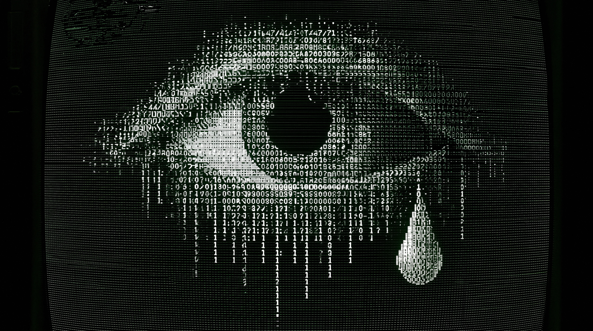

  

 

# A Parable: The Refinery and Time

At dusk, when the towers took on the color of wet steel, Time came down to the Han.

It came as rust beneath railings, as damp in stairwells, as paint drying over old stains, as the smell of rooms made clean before anyone asked why they had gone quiet.

Beside the river stood a refinery.

Its pipes crossed the bank like black veins. Its windows burned after midnight. Its gates opened before morning and closed with the softness of a practiced mouth.

“What do you refine?” asked Time.

“Hunger,” said the refinery. “Fear. Shame. Childhood. Duty. Whatever enters.”

“And what do you produce?”

“Order.”

The Han moved under the bridge.

All night the people entered.

Children came with sleep still in them. Workers came with their names folded small. Lovers came separately. Women came carrying futures the building had already priced. Men came with silence where their voices should have been.

Some came with bodies the forms would not hold.

Some came with papers that had crossed the sea before they understood water.

The refinery accepted what could be tightened.

The rest passed through smaller doors.

“Where do those doors lead?” asked Time.

“To private matters,” said the refinery.

Time touched the concrete.

It was still warm.

“Private is a word machines use when disposal has curtains.”

The refinery made a low sound.

“You speak against necessity.”

“I have watched necessity become appetite.”

“You speak against sacrifice.”

“I have watched altars learn to call themselves homes.”

“You speak against progress.”

“I have watched progress eat the future and blame the empty room.”

Above them, thousands of little windows opened in the hands of the crowd.

Each window watched.

Each window spoke.

Each window looked for something soft enough to punish.

“Who taught them to bite?” asked Time.

“No one,” said the refinery. “They are free.”

“Then why do they all draw blood in the same direction?”

The refinery did not answer.

From somewhere beyond the river came an old song.

It was not loud.

It was not pure.

It had crossed too many throats to belong to the clean.

Some heard longing in it.

Some heard obedience.

Some heard a road over a ridge.

Time heard something else.

It heard someone stop before permission was given.

It heard a hand searching in the dark.

It heard a name refusing the shape of its file.

“Songs do not repair pipes,” said the refinery.

“No,” said Time. “But they remember who was breathing before the pipe was built.”

The refinery brightened its lamps.

“There was nothing here before me.”

“There were seasons.”

“Seasons are slow.”

“So are children.”

“Children become useful.”

“Only after something is taken.”

For a while, only the river moved.

Near dawn, the gates opened again.

The floor was washed.

The forms were dry.

The mirrors obedient.

The small doors unmarked.

“Will you leave now?” asked the refinery.

“No,” said Time.

“Will you stop me?”

Time looked at the river.

The refinery asked again.

“Will you save them?”

The Han passed beneath the next bridge.

Time did not answer.
