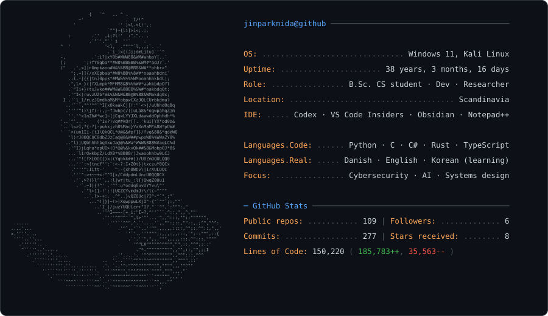
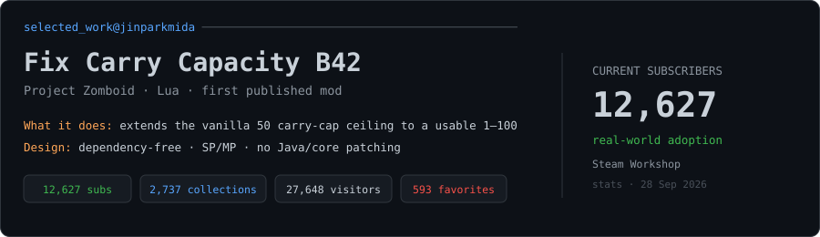

<picture>
  <source media="(prefers-color-scheme: dark)" srcset="dark_mode.svg">
  <source media="(prefers-color-scheme: light)" srcset="light_mode.svg">
  
</picture>

 

<!-- Selected work: keep each project as a matching dark/light SVG pair under /projects. -->
<a href="https://steamcommunity.com/sharedfiles/filedetails/?id=3774063062">
  <picture>
    <source media="(prefers-color-scheme: dark)" srcset="projects/fix_carry_capacity_dark.svg">
    <source media="(prefers-color-scheme: light)" srcset="projects/fix_carry_capacity_light.svg">
    
  </picture>
</a>
